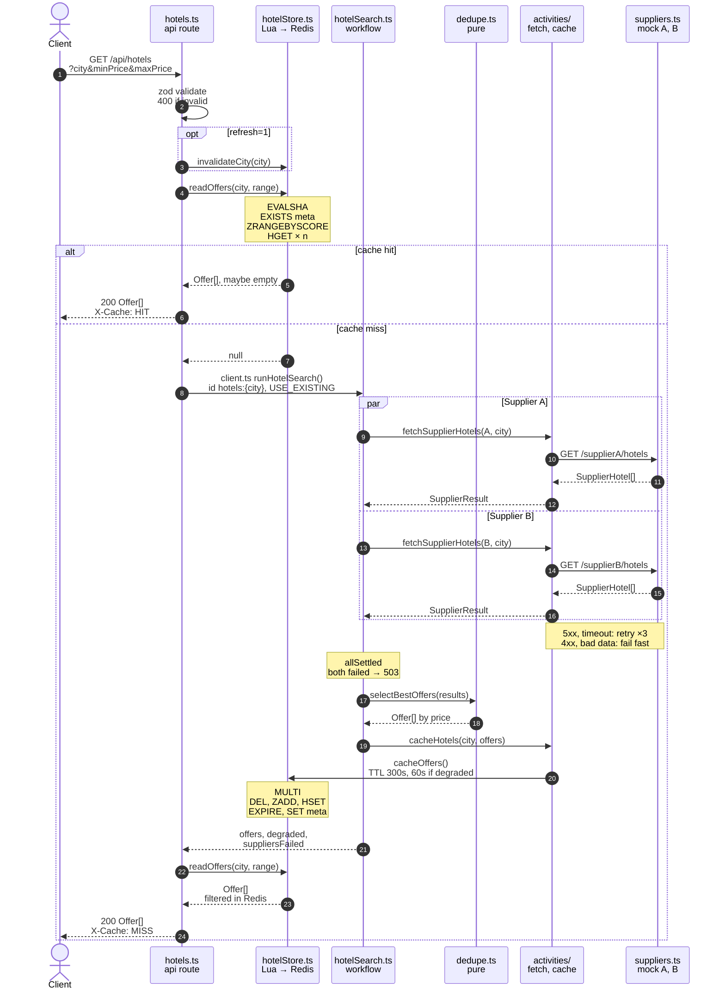
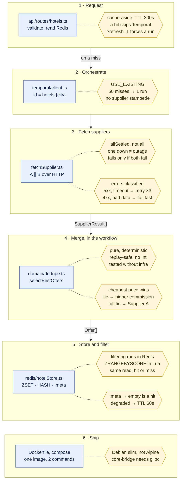

# Hotel Offer Orchestrator

Aggregates overlapping hotel offers from two mock suppliers, de-duplicates them by hotel name,
selects the best-priced offer for each hotel, and filters the result by price range.

The comparison is orchestrated by a **Temporal** workflow. The de-duplicated result is cached in
**Redis**, where the price filtering also happens — via a sorted set, not in application code.

---

## Contents

- [Quick start](#quick-start)
- [Endpoints](#endpoints)
- [How it works](#how-it-works)
- [Low-level design](#low-level-design)
- [Design decisions](#design-decisions)
- [Project layout](#project-layout)
- [Local development without Docker](#local-development-without-docker)
- [Tests](#tests)
- [Postman collection](#postman-collection)
- [Simulating a supplier outage](#simulating-a-supplier-outage)
- [Configuration](#configuration)

---

## Quick start

Requires Docker with Compose v2. Nothing else — Node, Temporal and Redis all run in containers.

```bash
docker compose up -d --build
```

First boot takes a couple of minutes: Temporal's `auto-setup` image creates its Postgres schema
before it accepts connections. The `api` and `worker` containers have `restart: unless-stopped`, so
if they start before Temporal is ready they exit and are restarted until it is. Wait for the API to
report healthy:

```bash
docker compose ps
```

Then:

```bash
curl "http://localhost:3000/api/hotels?city=delhi"
```

| Service | URL | What it is |
| --- | --- | --- |
| API | http://localhost:3000 | The service |
| Temporal Web UI | http://localhost:8080 | Every workflow execution, activity attempt and retry |
| Redis | localhost:6379 | Inspect with `docker compose exec redis redis-cli` |

Tear down with `docker compose down -v`.

---

## Endpoints

### `GET /api/hotels`

| Query param | Required | Notes |
| --- | --- | --- |
| `city` | yes | Case-insensitive. `delhi` and `mumbai` have data; anything else returns `[]`. |
| `minPrice` | no | Inclusive lower bound. Omitted means unbounded. |
| `maxPrice` | no | Inclusive upper bound. Omitted means unbounded. |
| `refresh` | no | `1` or `true` drops the cached city first, forcing a workflow run. |

```bash
curl "http://localhost:3000/api/hotels?city=delhi"
curl "http://localhost:3000/api/hotels?city=delhi&minPrice=5000&maxPrice=8000"
```

```json
[
  { "name": "Ibis", "price": 3200, "supplier": "Supplier A", "commissionPct": 8 },
  { "name": "Holtin", "price": 5340, "supplier": "Supplier B", "commissionPct": 20 },
  { "name": "Radison", "price": 5900, "supplier": "Supplier A", "commissionPct": 13 },
  { "name": "Leela", "price": 7000, "supplier": "Supplier B", "commissionPct": 18 },
  { "name": "Taj Palace", "price": 8200, "supplier": "Supplier A", "commissionPct": 15 },
  { "name": "Oberoy", "price": 9100, "supplier": "Supplier B", "commissionPct": 18 }
]
```

Results are ascending by price. Response headers describe how the answer was produced:

| Header | Values | Meaning |
| --- | --- | --- |
| `X-Cache` | `HIT` / `MISS` | Whether a workflow had to run |
| `X-Filter-Source` | `redis` / `memory-fallback` | Where the price filter executed |
| `X-Degraded` | `true` | A supplier failed; the result is from the survivors alone |
| `X-Suppliers-Failed` | e.g. `Supplier A` | Which ones failed |

Status codes: `200` (including an empty array for an unknown city), `400` for invalid query
parameters, `503` when no supplier could be reached at all.

### `GET /health`

Probes both suppliers, Redis and Temporal in parallel. `200` only when all four are up, `503`
otherwise, so a load balancer can act on the status code while a human reads the body.

```json
{
  "status": "ok",
  "uptimeSeconds": 42,
  "checks": {
    "supplierA": { "status": "up", "latencyMs": 3 },
    "supplierB": { "status": "up", "latencyMs": 2 },
    "redis": { "status": "up", "latencyMs": 1 },
    "temporal": { "status": "up", "latencyMs": 7 }
  }
}
```

### `GET /supplierA/hotels`, `GET /supplierB/hotels`

The mock suppliers. Optional `?city=`, plus `?fail=1` and `?delay=<ms>` for failure simulation.

---

## How it works

```
GET /api/hotels?city=delhi&minPrice=5000&maxPrice=8000
  │
  ├─ 1. Read Redis  ── hit ──▶  ZRANGEBYSCORE filters, respond      (X-Cache: HIT)
  │
  └─ 1. Read Redis  ── miss ─▶  2. Start Temporal workflow
                                     workflowId = "hotels:delhi"
                                        │
                                        ├── activity: fetch Supplier A ─┐  in
                                        └── activity: fetch Supplier B ─┘  parallel
                                        │
                                        ├── de-duplicate + pick best price   (pure, in workflow)
                                        └── activity: write Redis
                                     │
                                3. Read Redis again, filtered, respond  (X-Cache: MISS)
```

Both a hit and a miss answer through the same Redis read, so there is exactly one filtering code
path and the filter genuinely runs inside Redis in both cases.

### Selection rules

For each normalised hotel name (`trim` → collapse whitespace → lowercase):

1. Cheapest price wins.
2. Tie on price → higher `commissionPct` wins.
3. Tie on both → Supplier A wins, because the workflow folds A before B.
4. Only one supplier carries the hotel → that offer is used.
5. The winner's own spelling of the name is what gets returned.

Records with a blank name, or a price that is negative or not finite, are dropped before any of
this — a supplier returning `NaN` should not become a corrupt score in a Redis sorted set.

The fixtures are shaped to exercise every rule: `Holtin` and `Ibis` are cheaper on one supplier,
`Radison` on the other (and Supplier B spells it `"radison "`, to prove normalisation works),
`Leela` is priced identically by both so the commission decides, and `Taj Palace` / `Oberoy` exist
on one supplier only.

### Redis layout

Per city, three keys:

| Key | Type | Contents |
| --- | --- | --- |
| `hotels:delhi` | ZSET | member = normalised name, **score = price** |
| `hotels:delhi:data` | HASH | field = normalised name, value = the JSON offer |
| `hotels:delhi:meta` | STRING | presence marks "this city is cached" |

Reads go through one Lua script (`EVALSHA`), which checks the meta key, runs `ZRANGEBYSCORE`
between the requested bounds, and pulls the matching records out of the hash. One round trip, and
atomic against a concurrent cache refresh. Writes use `MULTI` for the same reason.

```bash
docker compose exec redis redis-cli ZRANGEBYSCORE hotels:delhi 5000 8000 WITHSCORES
```

---

## Low-level design

The request path at function level: every call between files, with its signature and the data
shape it carries. Numbers are execution order, `alt` splits a cache hit from a miss, and `par`
marks the two supplier calls running concurrently. On GitHub, the diagram's expand control shows
it full size.



---

## Design decisions

Each stage of a request, where it lives in the code (blue), and the decision made there (yellow).
The prose below explains the reasoning behind each one.



**Why the merge logic lives in the workflow, not an activity.** It is pure computation over data
the workflow already holds. Keeping it in workflow code makes it replay-visible and unit-testable
with no worker, no Redis and no HTTP. Activities are reserved for the things that can fail
independently: the two supplier calls and the cache write.

**Why `Promise.allSettled` and not `Promise.all`.** With `all`, one broken supplier fails a search
that the other supplier could have answered perfectly well. With `allSettled`, a dead supplier just
drops out of the input to the merge step — so "if only one supplier returns a hotel, select that
one" stops being a special case and becomes the ordinary path. The workflow only fails when *both*
suppliers are unreachable.

**Why the workflow id is `hotels:<city>`.** It makes Temporal de-duplicate concurrent requests too.
Fifty simultaneous requests for `delhi` produce one workflow execution: the first `start` creates
it and the rest attach via `USE_EXISTING`, then all await the same result. Without it, a cold cache
under load means fifty parallel calls to each supplier.

**Why suppliers are called over HTTP rather than in-process.** They stand in for third parties.
Reaching them over the network makes timeouts, non-2xx statuses and connection refusals genuinely
reachable states, which is what gives the retry policy and `/health` something real to do.

**Why a degraded result gets a 60s TTL instead of 300s.** A result assembled while a supplier was
down is incomplete. Caching it for the full five minutes would keep serving a partial answer long
after the supplier recovered.

**Why an unknown city is `200 []` and not `404`.** It is a well-formed question with no matches.
The empty answer is cached too — otherwise every request for a city with no hotels would re-run the
whole workflow, since an empty sorted set and an absent one look identical in Redis. That is what
the `:meta` key is for.

**Why error classification lives in the activity.** Temporal retries anything that escapes an
activity, so the activity's job is to decide what deserves a retry. Timeouts, network faults, 5xx,
408 and 429 are thrown as ordinary errors and retried. Other 4xx responses and malformed payloads
are thrown as non-retryable `ApplicationFailure`s with an explicit `type` that the workflow's
`nonRetryableErrorTypes` matches — asking the same broken question three times just adds latency
to a guaranteed identical answer.

**Why Debian slim and not Alpine.** `@temporalio/core-bridge` is a native Rust addon whose prebuilt
binaries target glibc. On musl the install either falls back to a slow source build or fails.

---

## Project layout

```
src/
  config/env.ts              zod-validated environment, exits on bad config
  domain/
    types.ts                 SupplierHotel, SupplierResult, Offer
    dedupe.ts                the selection rules — pure, no I/O
  suppliers/fixtures.ts      hardcoded supplier catalogues
  redis/
    client.ts                ioredis singleton + custom command registration
    scripts.ts               the Lua read script
    hotelStore.ts            key layout, cache write, filtered read
  temporal/
    client.ts                connection, workflow start, failure unwrapping
    worker.ts                worker process entrypoint
    workflows/hotelSearch.ts orchestration
    activities/              fetchSupplier.ts, cacheHotels.ts
  api/
    server.ts                express app + entrypoint
    asyncHandler.ts          routes async rejections to the error middleware
    errors.ts                HttpError
    routes/                  hotels.ts, health.ts, suppliers.ts
tests/
  dedupe.spec.ts             25 cases covering every selection rule
  workflow.spec.ts           5 cases against Temporal's time-skipping test server
```

The API and the worker are two processes from **one image**; Compose overrides the command for the
worker. One artifact to build, tag and promote.

---

## Local development without Docker

Infrastructure still needs to run somewhere. Start just the dependencies:

```bash
docker compose up -d postgresql temporal redis
```

Then, in two terminals:

```bash
npm install
npm run dev:api
```

```bash
npm run dev:worker
```

Defaults in `src/config/env.ts` already point at `localhost`, so no `.env` is needed. Copy
`.env.example` to `.env` if you want to change anything.

---

## Tests

```bash
npm test
```

30 tests, no Docker required — Temporal's time-skipping test server is a binary the SDK downloads
on first run.

- `tests/dedupe.spec.ts` — the selection rules as executable spec: cheapest wins, commission breaks
  a price tie, input order breaks a full tie, normalisation merges spelling variants, invalid
  records are dropped, output ordering is stable, the function does not mutate its input.
- `tests/workflow.spec.ts` — real workflow executions with stubbed activities: both suppliers
  merged, one supplier down still returns the survivor's hotels, a flaky supplier retried and
  succeeding on the third attempt, total outage failing with `AllSuppliersUnavailable`, and an
  unknown city caching its empty result.

The retry test is worth a look — retry backoffs complete instantly under time skipping, so a policy
with real-world intervals is still testable in milliseconds.

Also available: `npm run typecheck`, `npm run build`.

---

## Postman collection

`postman/hotel-offer-orchestrator.postman_collection.json` — import it and set `baseUrl` if the
service is not on `http://localhost:3000`.

Requests, with assertions on each:

| Request | Covers |
| --- | --- |
| Health check | All four dependencies reported |
| Hotels — delhi (cold) | Overlaps de-duplicated, cheapest wins, tie broken by commission, sorted by price |
| Hotels — delhi (warm) | `X-Cache: HIT`, filtered in Redis |
| Hotels — price range | `minPrice`/`maxPrice`, inclusive bounds |
| Hotels — open-ended range | Omitted bound means unbounded |
| Hotels — city with no results | `200 []`, not `404` |
| Hotels — missing city | `400` naming the offending field |
| Hotels — inverted range | `400` |
| Supplier A / B raw feeds | Compare raw prices against the merged output |
| Supplier A simulated outage | The `?fail=1` switch itself |
| Hotels — degraded | Search survives one supplier being down (see below) |
| Hotels — mumbai | Cache is keyed per city |

Run the cold request before the warm one — the ordering is the point.

---

## Simulating a supplier outage

Three ways, in increasing order of realism:

**A single request**, no restart needed:

```bash
curl "http://localhost:3000/supplierA/hotels?city=delhi&fail=1"
```

**A whole supplier**, for the degraded-search case:

```bash
SUPPLIER_A_DOWN=true docker compose up -d api
curl -i "http://localhost:3000/api/hotels?city=delhi&refresh=1"
```

The search still succeeds using Supplier B alone, the response carries `X-Degraded: true` and
`X-Suppliers-Failed: Supplier A`, and the partial result is cached for 60s rather than 300s.
`/health` reports `supplierA` as `down` and returns `503`.

Restore both suppliers with:

```bash
docker compose up -d api
```

**A timeout**, to watch the retry policy work: `?delay=6000` exceeds `SUPPLIER_TIMEOUT_MS`, so the
activity times out and Temporal retries it. The attempts are visible in the Temporal UI at
http://localhost:8080.

---

## Configuration

Every variable is validated at startup; the process exits rather than running half-configured.

| Variable | Default | Purpose |
| --- | --- | --- |
| `PORT` | `3000` | API port |
| `LOG_LEVEL` | `info` | pino level |
| `TEMPORAL_ADDRESS` | `localhost:7233` | Temporal frontend |
| `TEMPORAL_NAMESPACE` | `default` | |
| `TEMPORAL_TASK_QUEUE` | `hotel-offers` | Must match between API and worker |
| `REDIS_URL` | `redis://localhost:6379` | |
| `CACHE_TTL_SECONDS` | `300` | TTL for a complete result |
| `SUPPLIER_A_URL` | `http://localhost:3000/supplierA/hotels` | |
| `SUPPLIER_B_URL` | `http://localhost:3000/supplierB/hotels` | |
| `SUPPLIER_TIMEOUT_MS` | `5000` | Per-attempt timeout |
| `SUPPLIER_A_DOWN` | `false` | Failure simulation |
| `SUPPLIER_B_DOWN` | `false` | Failure simulation |
